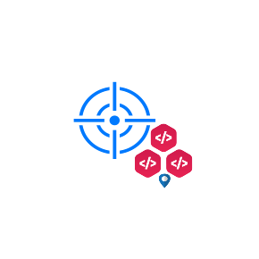
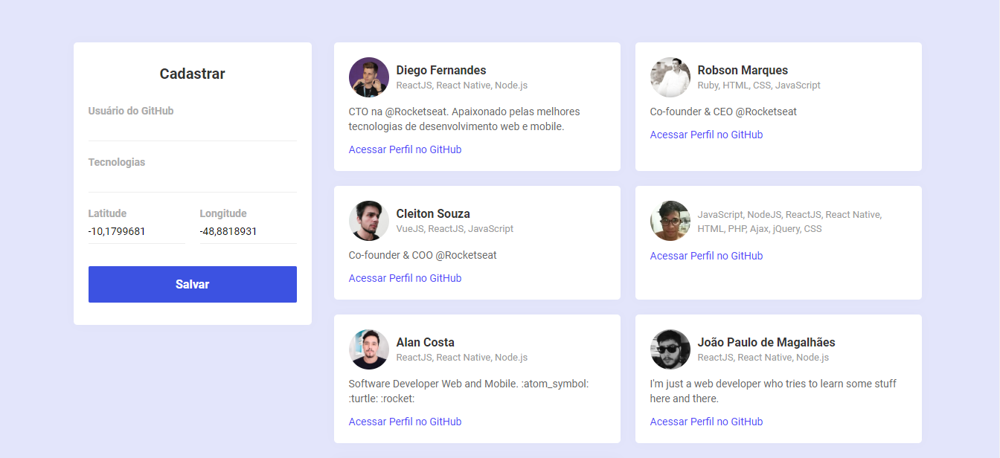
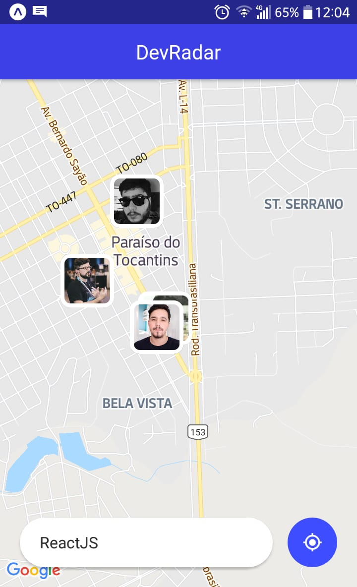

<div align="center">
  </img>
</div>

<h1 align="center"> <strong> Semana Omnistack 10 </strong> </h1>

<p align="center">Projeto <strong>DevRadar</strong> - Rocketseat</p>

<p align="center">
  <a aria-label="Versão do Node" href="https://github.com/nodejs/node/blob/master/doc/changelogs/CHANGELOG_V12.md#12.14.1">
    </img>
  </a>

  <a aria-label="Versão do React" href="#">
    </img>
  </a>
  
  <a aria-label="Versão do Expo" href="#">
    </img>
  </a>  
    
  <a aria-label="Rocketseat" href="#">
    </img>
  </a>

  <a aria-label="License" href="#">
    </img>
  </a>  
  
</p>

## Instalação
Para que o projeto funcione corretamente você deverá clonar o projeto em seu computador e configura-lo de acordo com os seus parâmetros, configurando a sua base de dados MongoDB, bem como atualizar a string de conexão com seu `User:Senha` no arquivo `index.js`.

### obs:
Lembre-se: **configure as portas corretamente, para que não aja conflito entre seus projetos ou aplicações que já estejam em execução.**

### Dependências

##### Para Execução do -> Backend
Para instalar e executar o **Backend**, acesse a pasta backend com o seu terminal e em seguida execute:
```bash
yarn install
yarn dev
```
##### Para Execução do ->  Frontend
Para instalar e executar o **Frontend**, acesse a pasta backend com o seu terminal e em seguida execute:
```bash
yarn install
yarn start
```
Assim que o processo terminar, automaticamente será aberta uma página `localhost:3000` em seu navegador padrão, com o frontend sendo executado. 

##### Para Execução do ->  Mobile
Para executar a aplicação **Mobile**, primeiro configure o endereço do servidor no arquivo `src/services/api.js`, de acordo com o seus parâmetros de rede "seu `ip`", e a porta configurada no backend, para que a aplicação mobile consiga acessa a base de dados, em seguida abra o terminal dentro da pasta mobile e depois execute os comandos:
```bash
# Caso ja possua o Expo (CLI) instalado! não execute  aprimeira linha de código
yarn global add install expo-cli
yarn install
yarn start
```
Assim que o processo terminar, automaticamente será aberta uma página `localhost:19002` em seu navegador padrão. Conecte seu emulador, caso não o possua instalado e queira utiliza-lo estes links o ajudaram nesta tarefa, assim como uma explicação sobre o funcionamento do emulador, [Rocketseat Docs Emulador Mobile](https://docs.rocketseat.dev/ambiente-react-native/android/emulador), [Emulando React Native no iOS/Android com Expo](https://www.youtube.com/watch?v=eSjFDWYkdxM).

Caso queira testa a aplicação mobile via `LAN`: baixe o aplicativo *Expo* na Play Store ou App Store e em seguida escaneie o código QR que aparece no canto esquerdo inferior da página aberta no seu navegador padrão.

## Frontend
Web -> resultado da aplicação em execução:

</img>

## Mobile
App Mobile (React Native) -> resultado da execução:
<div align="center">
  </img>
</div>

## Licença

[MIT](./LICENSE) - by Rocketseat - [Rocketseat](https://rocketseat.com.br/)